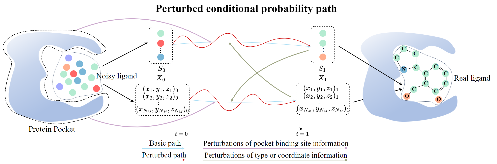

# Perturbed Flow Matching for Structure-Based Drug Design

[](./LICENSE)

This is the official implementation of the paper "Perturbed Flow Matching for Structure-Based Drug Design". [[PDF]]

<p align="center">
   
</p>

## Installation

### Key Dependencies
- Python | 3.8.18
- PyTorch | 2.0.1+cu117
- PyTorch Geometric | 2.4.0
- RDKit | 2022.03.5
- AutoDock Vina | 1.2.0

For all dependencies, please refer to `requirements.txt`.

### AutoDock Vina Setup
1. Install AutoDock Vina
```bash
pip install meeko==0.1.dev3 scipy pdb2pqr vina==1.2.2 
python -m pip install git+https://github.com/Valdes-Tresanco-MS/AutoDockTools_py3
```

2. Replace `vina.py` file in the package with `utils/vina.py`

## Data

### Preprocessed Data
We provide preprocessed data [here](https:).

### Data Processing
If you want to process your own data, please refer to [TargetDiff](https://github.com/guanjq/targetdiff).

## Training
### Step 1: Select training mode
To train the models, modify the `train.training_mode` in `training.yml`.
### Step 2: Run
```bash
python scripts/train_fm.py ../configs/training.yaml
```

## Sampling
To sample from the test set:
```bash
python scripts/sample_fm.py ../configs/sampling.yml
```
If you aim to generate proteins outside the dataset, you first need to identify the approximate center of the pocket and utilize `scripts/data_preparation/clean_pocket` to obtain a relatively smaller PDB file for subsequent generation.

## Evaluation
To evaluate the models:
```bash
python scripts/evaluate_fm.py {OUTPUT_DIR} --docking_mode vina_score --protein_root {PROTEIN_ROOT}
```
Please note that {PROTEIN_ROOT} is the original dataset CrossDocked2020 v1.1, which can be downloaded [here](https://bits.csb.pitt.edu/files/crossdock2020/).
## Future Work

We are committed to developing a truly applicable method that enables chemists and biologists to effortlessly utilize it for efficient drug discovery.

## Citation

If you find this code useful for your research, please cite our paper:
```
[...]
```

### Acknowledgments

This project builds upon several previous works. We recommend citing the following papers:
```
@inproceedings{guan3d,
  title={3D Equivariant Diffusion for Target-Aware Molecule Generation and Affinity Prediction},
  author={Guan, Jiaqi and Qian, Wesley Wei and Peng, Xingang and Su, Yufeng and Peng, Jian and Ma, Jianzhu},
  booktitle={International Conference on Learning Representations},
  year={2023}
}
```
```
@article{tong2023simulation,
  title={Simulation-free schr$\backslash$" odinger bridges via score and flow matching},
  author={Tong, Alexander and Malkin, Nikolay and Fatras, Kilian and Atanackovic, Lazar and Zhang, Yanlei and Huguet, Guillaume and Wolf, Guy and Bengio, Yoshua},
  journal={arXiv preprint arXiv:2307.03672},
  year={2023}
}
```